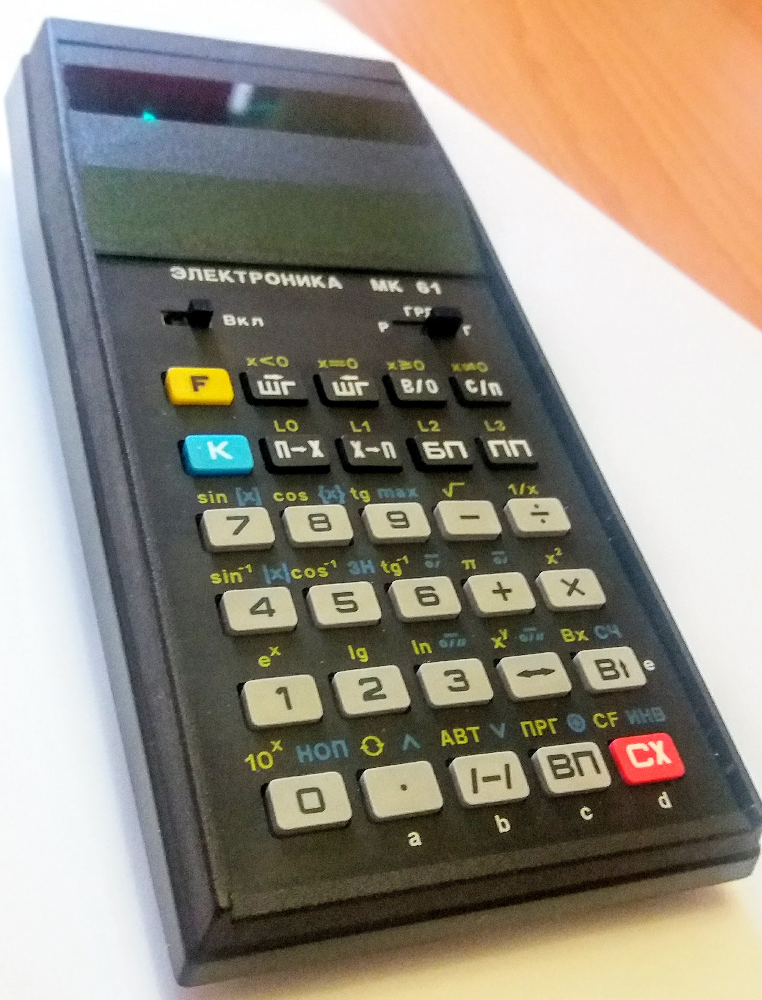
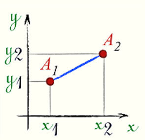
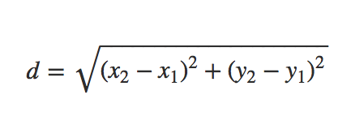
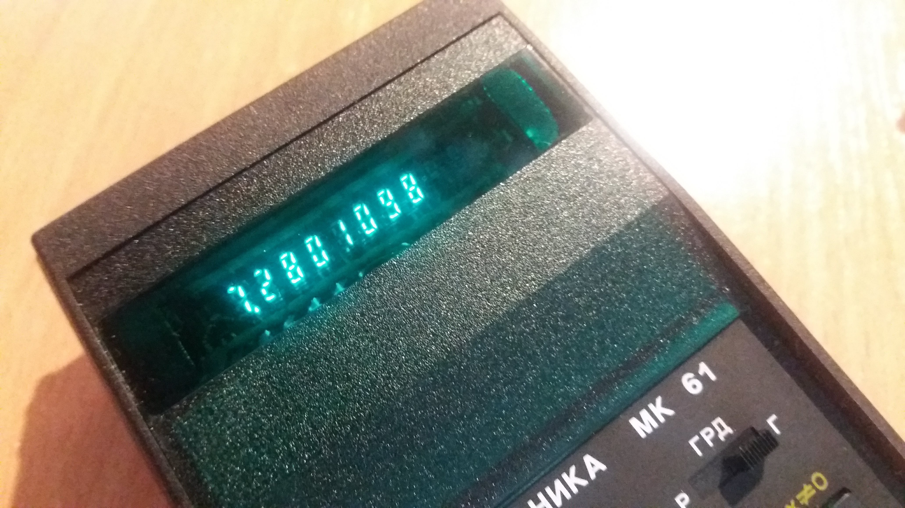

## Program for MK 61
#### Here sample program for programmable micro calculator MK 61

Lets estimate length (d) of the line A1 A2

here is formula

Add program to calculator.

Entering to programming mode with F ПРГ

| Line  | Keyboards key  |Key of Code|
| :---- | :------------- |:----|
| 00       | ПХ 1      |61|
| 01       | ПХ 2      |62|
| 02       | -         |11|
| 03       | F x2      |22|
| 04       | ПХ 3      |63|
| 05       | ПX 4      |64|
| 06       | -         |11|
| 07       | F x2      |22|
| 08       | +         |10|
| 09       | F √       |21|
| 10       |с/п        |50|

Exit from programming mode F АВТ

Entering data to calculator

X1 =  1 XП1

X2 =  8 XП2

Y1 =  2 ХП3

Y2 =  4 ХП4

Start program with в/о and с/п

end get result  7.2801098

